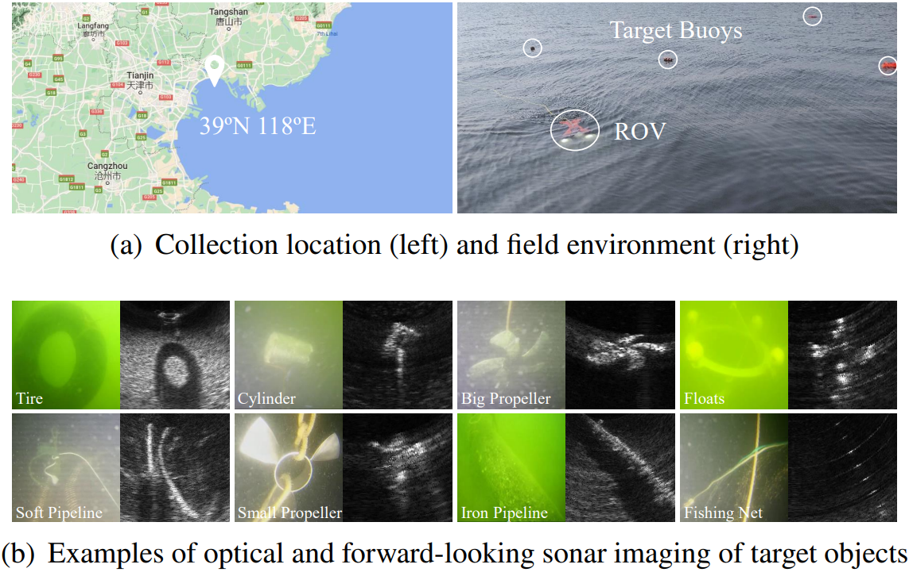

# NK-Sonar-Image-Dataset (NKSID)
Eng|[简体中文](https://github.com/Jorwnpay/NK-Sonar-Image-Dataset/blob/main/Readme_zh.md)

This repo publishes a newly created forward-looking sonar image recognition benchmark, named NanKai Sonar Image Dataset (NKSID). This dataset contains 2617 images from 8 categories, with labels showing a natural long tail distribution. 

### Introduction

The data collection occured in Bohai Bay ($39^\circ N 118^\circ E$), as shown on the left in Fig. 1(a). Specifically, we used a Remotely Operated Vehicle (ROV) equipped with a multi-beam forward-looking sonar (Oculus M750d) to capture underwater data. In order to reduce interference between targets and facilitate localization, targets were attached to buoys using ropes and suspended at depths of approximately 5-10 meters below the water surface. A target was placed at regular intervals, as illustrated on the right in Fig. 1(a). During data collection, we captured images of each target from different perspectives, ranges (2-15m), and frequencies (750kHz, 1.2MHz) to enhance the richness of the dataset. Subsequently, the targets were selected, preprocessed, and annotated, resulting in 2617 images across eight classes. Fig. 1(b) illustrates examples of optical and sonar images for each of the eight classes, highlighting that NKSID exhibits a natural long-tail distribution.



### Usage

Download the dataset directly from the repository and unzip all `.zip` files in the extracted folder. Due to individual files exceeding the GitHub upload limit, each category's images are compressed separately. The `tire` folder contains two compressed packages that need to be unpacked separately.

`train_abs.txt` contains the relative paths and labels for each image.

`kfold_train.txt` and `kfold_val.txt` store the random "training set/validation set" splits for ten-fold cross-validation. The number $n$ inside represents the sample index, corresponding to the $n$ th line in `train_abs.txt`.

Demo Usage: A repository demonstrating open-set long-tail recognition using this dataset can be found at [Jorwnpay/Sonar-OLTR (github.com)](https://github.com/Jorwnpay/Sonar-OLTR).

### Citation

If the dataset proves valuable for your work, please consider citing our paper:

```latex
@article{jiao2024open,
  title={Open-set recognition with long-tail sonar images},
  author={Jiao, Wenpei and Zhang, Jianlei and Zhang, Chunyan},
  journal={Expert Systems with Applications},
  pages={123495},
  year={2024},
  publisher={Elsevier}
}
```

